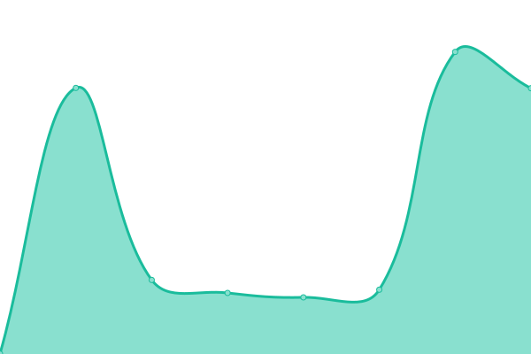

# [📈 Live Status](https://cloudpunks.github.io/cloudpunks-upptime): <!--live status--> **🟩 All systems operational**

This repository contains the open-source uptime monitor and status page for [cloudpunks](https://www.cloudpunks.de/), powered by [Upptime](https://github.com/upptime/upptime).

With [Upptime](https://upptime.js.org), you can get your own unlimited and free uptime monitor and status page, powered entirely by a GitHub repository. We use [Issues](https://github.com/cloudpunks/cloudpunks-upptime/issues) as incident reports, [Actions](https://github.com/cloudpunks/cloudpunks-upptime/actions) as uptime monitors, and [Pages](https://cloudpunks.github.io/cloudpunks-upptime) for the status page.

<!--start: status pages-->
<!-- This summary is generated by Upptime (https://github.com/upptime/upptime) -->
<!-- Do not edit this manually, your changes will be overwritten -->
<!-- prettier-ignore -->
| URL | Status | History | Response Time | Uptime |
| --- | ------ | ------- | ------------- | ------ |
|  [cloudpunks - website](https://www.cloudpunks.de) | 🟩 Up | [cloudpunks-website.yml](https://github.com/cloudpunks/cloudpunks-upptime/commits/HEAD/history/cloudpunks-website.yml) | 

 335ms
     
 | 

<a href="https://cloudpunks.github.io/cloudpunks-upptime/history/cloudpunks-website">100.00%</a>
    

|  [cloudpunks - auth service](https://auth.cloudpunks.io/auth/realms/core) | 🟩 Up | [cloudpunks-auth-service.yml](https://github.com/cloudpunks/cloudpunks-upptime/commits/HEAD/history/cloudpunks-auth-service.yml) | 

 676ms
     
 | 

<a href="https://cloudpunks.github.io/cloudpunks-upptime/history/cloudpunks-auth-service">100.00%</a>
    

|  [cloudpunks - git service](https://git.cloudpunks.io) | 🟩 Up | [cloudpunks-git-service.yml](https://github.com/cloudpunks/cloudpunks-upptime/commits/HEAD/history/cloudpunks-git-service.yml) | 

 746ms
     
 | 

<a href="https://cloudpunks.github.io/cloudpunks-upptime/history/cloudpunks-git-service">100.00%</a>
    

|  [cloudpunks - marketplace](https://marketplace.cloudpunks.de/) | 🟩 Up | [cloudpunks-marketplace.yml](https://github.com/cloudpunks/cloudpunks-upptime/commits/HEAD/history/cloudpunks-marketplace.yml) | 

 953ms
     
 | 

<a href="https://cloudpunks.github.io/cloudpunks-upptime/history/cloudpunks-marketplace">99.78%</a>
    

|  [cloudpunks - k8s lab](https://rancher.cloudpunks.io) | 🟩 Up | [cloudpunks-k8s-lab.yml](https://github.com/cloudpunks/cloudpunks-upptime/commits/HEAD/history/cloudpunks-k8s-lab.yml) | 

 660ms
     
 | 

<a href="https://cloudpunks.github.io/cloudpunks-upptime/history/cloudpunks-k8s-lab">100.00%</a>
    

<!--end: status pages-->

[**Visit our status website →**](https://cloudpunks.github.io/cloudpunks-upptime)

## 📄 License

- Powered by: [Upptime](https://github.com/upptime/upptime)
- Code: [MIT](./LICENSE) © [Anand Chowdhary](https://anandchowdhary.com), supported by [Pabio](https://pabio.com)
- Data in the `./history` directory: [Open Database License](https://opendatacommons.org/licenses/odbl/1-0/)
